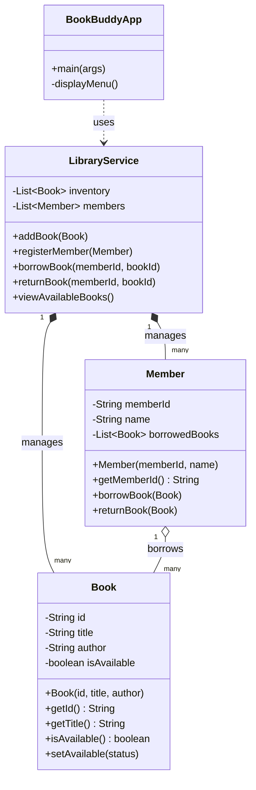
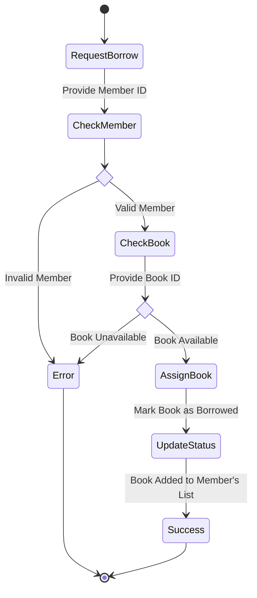
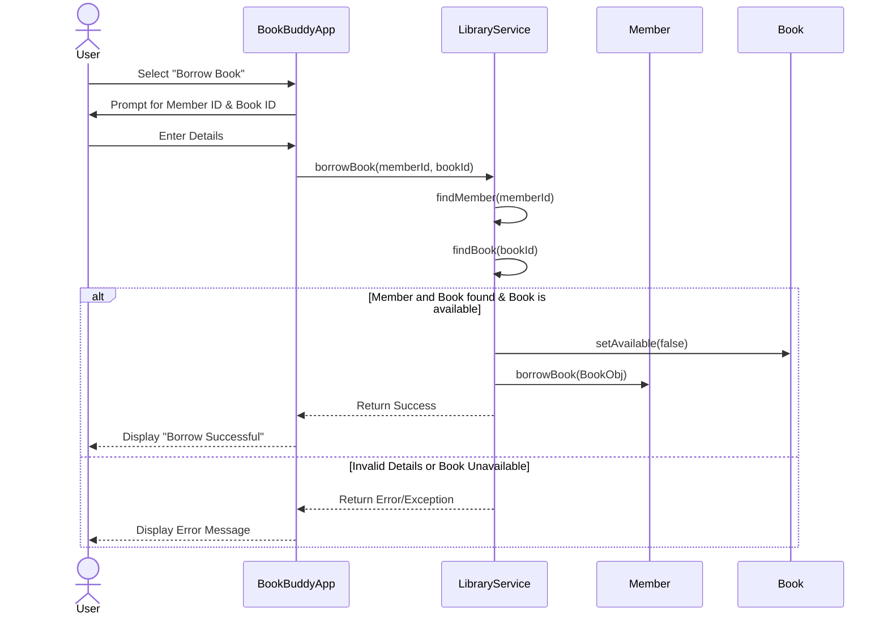

# Analyzing the Role of AI-Assisted Programming in Modern Software Development

## Task 1: Conceptual Understanding

### What is AI-Assisted Programming?
AI-assisted programming refers to the integration of Artificial Intelligence (AI) and Machine Learning (ML) algorithms into the software development lifecycle to aid developers in writing, analyzing, and optimizing code. Rather than replacing human engineers, these tools act as intelligent "pair programmers," processing natural language inputs and contextual code to offer real-time suggestions, automate repetitive tasks, and identify structural flaws. 

### Types of AI Coding Tools
AI coding tools generally fall into several functional categories:
1. **Code Generation:** Tools like GitHub Copilot and ChatGPT can generate entire boilerplate structures, classes, or specific algorithms based on natural language prompts (e.g., "Create a Java method to filter available books").
2. **Debugging Assistants:** AI can analyze stack traces, identify logical errors, and suggest localized fixes to resolve runtime exceptions without requiring manual line-by-line tracing.
3. **Refactoring and Optimization:** AI models can review existing, functional code and propose structural improvements—such as converting legacy procedural loops into modern Java Streams to enhance readability and performance.
4. **Documentation and Test Generation:** AI tools excel at automatically writing comprehensive JavaDocs and generating unit test suites covering multiple edge cases, saving significant developer time.

### Advantages in Software Development
The integration of AI offers substantial technical advantages. It drastically reduces **development time** by automating the creation of boilerplate code. It enhances **code quality** by suggesting established design patterns and best practices. Furthermore, it lowers the barrier to entry for complex syntaxes, allowing developers to focus on high-level architectural design and business logic rather than memorizing standard library APIs.

### Risks and Limitations
Despite the benefits, AI-assisted programming introduces notable risks:
1. **Hallucinated Code:** AI models may generate syntactically correct but logically flawed code, or reference APIs and libraries that do not exist.
2. **Developer Dependency:** Over-reliance on AI can lead to a degradation of fundamental problem-solving skills and a lack of deep understanding of the underlying system architecture.
3. **Security Vulnerabilities:** If an AI model was trained on outdated or insecure code repositories, it might inadvertently introduce vulnerabilities (e.g., SQL injection risks or improper exception handling) if the developer does not rigorously review the output.

---

## Task 2: Practical Implementation

For the practical component of this assignment, we developed **BookBuddy**, a Library Management System of moderate complexity. The system allows librarians to add books and register members, while members can borrow and return books.

The system was developed using TWO distinct approaches to compare traditional methodologies against AI-assisted workflows.

### BookBuddy System Design (UML Diagrams)

#### Use Case Diagram
```mermaid
usecaseDiagram
    actor Librarian
    actor Member
    
    package BookBuddy_System {
        usecase "Add Book" as UC1
        usecase "Register Member" as UC2
        usecase "Borrow Book" as UC3
        usecase "Return Book" as UC4
        usecase "View Available Books" as UC5
    }
    
    Librarian --> UC1
    Librarian --> UC2
    Librarian --> UC3
    Librarian --> UC4
    
    Member --> UC3
    Member --> UC4
    Member --> UC5
```

#### Class Diagram


#### Activity Diagram


#### Sequence Diagram


### Implementation Comparison

| Metric | Version A: Traditional Approach | Version B: AI-Assisted Approach |
| :--- | :--- | :--- |
| **Development Time** | High. Significant time spent manually typing boilerplate (constructors, getters) and debugging index-bounds in basic loops. | Low. AI models rapidly scaffolded the entity classes and refactored the search algorithms in seconds. |
| **Code Quality** | Basic and verbose. Relies heavily on traditional `for` and `while` loops to mutate states and search through lists. | Elegant and modern. Utilizes Java 17 Streams API and Lambda expressions, reducing verbosity and improving immutability. |
| **Error Handling** | Procedural. Uses generic `if-else` blocks and prints `System.out.println("Error")` directly when failing to locate data. | Robust. Defines custom exception classes (`BookNotFoundException`) and utilizes a centralized multi-catch block in the UI layer. |
| **Readability & Maintainability**| Harder to maintain as the application scales. Business logic and error logging are deeply intertwined. | Highly maintainable. Clean separation of concerns. Business logic strictly throws exceptions; the UI layer strictly handles display. |

### Code Generation Breakdown
- **Manually Written:** The overarching architectural decisions, the Maven configuration (`pom.xml`), the exact structure of the CLI menus, and the structural relationships between the `Book` and `Member` domain models.
- **AI-Assisted:** The conversion of procedural search loops into Java Streams pipelines (`.stream().filter().findFirst().orElseThrow()`), the generation of JavaDocs, the implementation of defensive copying (`Collections.unmodifiableList`), and the specific implementation of the multi-catch exception blocks.

---

## Task 3: Critical Analysis

### How AI Changed the Coding Approach
Traditionally, software development demands a heavy focus on syntax memorization and manual debugging. Utilizing AI drastically shifted this focus. Instead of spending time debugging a `NullPointerException` or configuring loop indices, the development approach evolved into high-level system design and "prompt engineering." The primary task shifted from *writing* code to *reviewing, guiding, and architecting* code.

### Impact on Understanding
AI-assisted programming acts as a double-edged sword regarding logical understanding. On one hand, it significantly *improved* understanding of modern Java features. Seeing the AI instantly convert a clunky `for` loop into an elegant Stream provided an immediate, practical tutorial on functional programming. Conversely, if a student blindly accepts AI outputs without reading the logic, it heavily *reduces* fundamental understanding, turning the developer into a passive assembler rather than an active engineer.

### When AI Should NOT Be Used
AI should not be deployed in environments involving highly sensitive, proprietary, or classified intellectual property, as prompts sent to cloud-based models could leak corporate secrets. Furthermore, AI should not be trusted implicitly to handle complex cryptographic algorithms or core security authentication flows without rigorous human security audits, as models are prone to generating functional but inherently insecure code. Finally, beginners should avoid over-relying on AI for fundamental logic exercises, as struggling through algorithmic challenges is essential for cognitive development in computer science.

### Ethical Considerations
Software engineers retain the ultimate ethical and legal responsibility for the code they deploy, regardless of whether it was written manually or generated by an AI. Blaming an AI for a data breach or a critical system failure is professionally unacceptable. Engineers must treat AI output as an untrusted dependency that requires strict code review, unit testing, and validation before merging into a production environment. 

---

## Task 4: Conclusion

The integration of AI-assisted programming tools marks a paradigm shift in the software engineering industry. In computing education, AI serves as an unparalleled interactive tutor, demystifying complex concepts and accelerating the learning curve for modern frameworks. In the tech industry, it acts as a powerful productivity multiplier, automating the mundane and allowing engineers to focus on creative, high-impact architectural challenges.

However, AI is an assistant, not a replacement. The value of a software engineer no longer lies purely in writing syntax, but in critical thinking, system design, and the ability to rigorously validate AI-generated logic. As long as engineers maintain a healthy skepticism and uphold strict ethical standards for code review, AI-assisted programming will remain an invaluable asset in the modern development toolkit.

---

**GitHub Repository:** [Insert Link Here]
