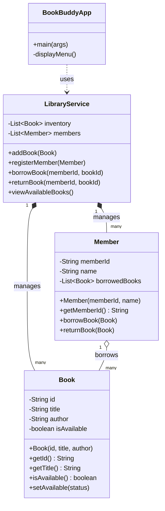
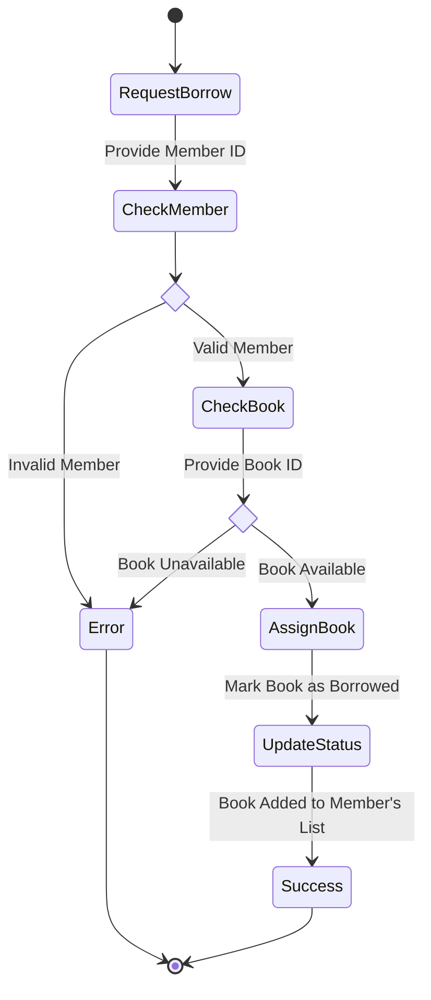
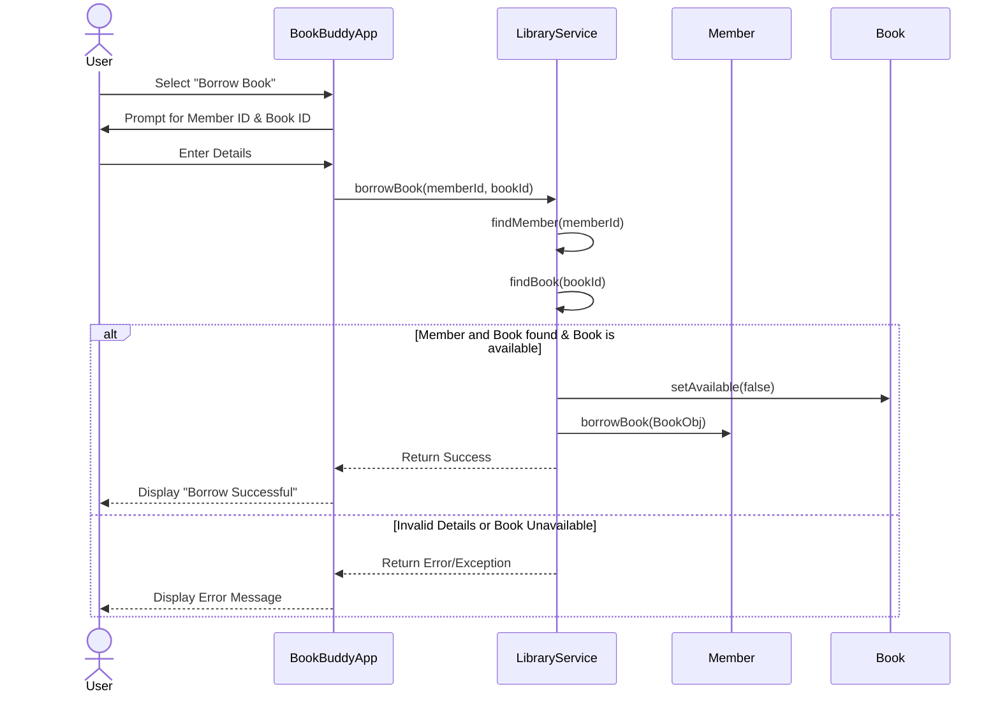

# BookBuddy Library Management System Design

## 1. Directory Tree Structure

Here is the proposed Maven project structure. We will keep it contained within the existing `AI-Assisted-Programming` project folder.

```text
AI-Assisted-Programming/
├── pom.xml
└── src/
    └── main/
        └── java/
            └── com/
                └── assignment/
                    ├── version_a/                  (Traditional Approach)
                    │   ├── BookBuddyAppA.java      (Main Application Entry)
                    │   ├── models/
                    │   │   ├── Book.java
                    │   │   └── Member.java
                    │   ├── services/
                    │   │   └── LibraryService.java (Core logic using manual loops)
                    │   └── utils/
                    │       └── InputValidator.java 
                    │
                    └── version_b/                  (AI-Assisted Approach)
                        ├── BookBuddyAppB.java      (Main Application Entry)
                        ├── models/
                        │   ├── Book.java           (Using Java Records if applicable)
                        │   └── Member.java
                        ├── services/
                        │   └── LibraryService.java (Core logic using Streams/Optionals)
                        └── exceptions/
                            ├── BookNotFoundException.java
                            └── MemberNotFoundException.java
```

## 2. Maven `pom.xml` Configuration

Your current `pom.xml` is perfectly suited for this, as it is already configured for Java 17. We can keep it exactly as it is, as we don't strictly need external dependencies for a standard CLI application. 

```xml
<?xml version="1.0" encoding="UTF-8"?>
<project xmlns="http://maven.apache.org/POM/4.0.0"
         xmlns:xsi="http://www.w3.org/2001/XMLSchema-instance"
         xsi:schemaLocation="http://maven.apache.org/POM/4.0.0 http://maven.apache.org/xsd/maven-4.0.0.xsd">
    <modelVersion>4.0.0</modelVersion>

    <groupId>lk.lsk</groupId>
    <artifactId>AI-Assisted-Programming</artifactId>
    <version>1.0-SNAPSHOT</version>

    <properties>
        <maven.compiler.source>17</maven.compiler.source>
        <maven.compiler.target>17</maven.compiler.target>
        <project.build.sourceEncoding>UTF-8</project.build.sourceEncoding>
    </properties>

</project>
```

---

## 3. UML Diagrams

Below are the Mermaid syntaxes for the four required UML diagrams. 

> [!TIP]
> You can copy and paste these code blocks into [Mermaid Live Editor](https://mermaid.live/) to export them as PNGs, or leave them as they are in the Markdown report if your Markdown-to-PDF tool supports Mermaid.

### 3.1. Use Case Diagram

```mermaid
usecaseDiagram
    actor Librarian
    actor Member
    
    package BookBuddy_System {
        usecase "Add Book" as UC1
        usecase "Register Member" as UC2
        usecase "Borrow Book" as UC3
        usecase "Return Book" as UC4
        usecase "View Available Books" as UC5
    }
    
    Librarian --> UC1
    Librarian --> UC2
    Librarian --> UC3
    Librarian --> UC4
    
    Member --> UC3
    Member --> UC4
    Member --> UC5
```

### 3.2. Class Diagram



### 3.3. Activity Diagram

*This illustrates the activity flow for a Member borrowing a book.*



### 3.4. Sequence Diagram

*This illustrates the interactions when borrowing a book.*


